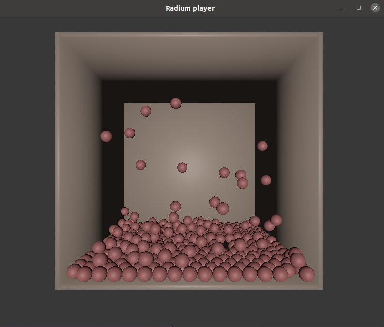

# PBSphere
A little PBS algorithm based on this [paper] and made with [Radium engine], a 3D Engine created by STORM-IRIT.



here is the result i get with just distance constraints


## Notes

- [Radium engine] and all his dependencies are required (you can get all the details directly on their github page).

- The compilation can easily be done by using the cmake file, just do not forget to add the path to radium-engine (with ```-DRadium_DIR="path to radium engine"```).


[Radium engine]: https://github.com/STORM-IRIT/Radium-Engine
[paper]: http://mmacklin.com/EG2015PBD.pdf
